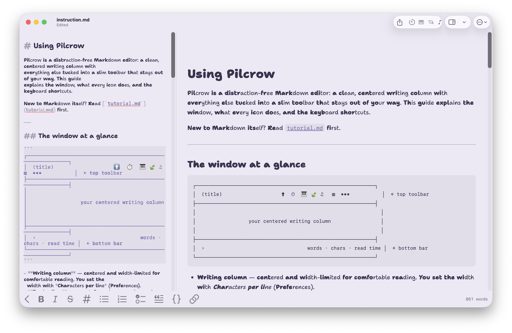

# Pilcrow



A native macOS distraction-free Markdown editor, built in SwiftUI + AppKit/TextKit.
Pilcrow is a ground-up rewrite of [Apostrophe](https://gitlab.gnome.org/World/apostrophe)
(the GNOME/GTK editor) — made for calm, focused writing.

Hey friends 👋 — here's what makes it a nice place to write:

- 🍅 **Built-in Pomodoro timer**, right in the toolbar — focus, break, repeat.
- 🎧 **Background sounds for reading & writing** — soft instrumental piano, nature loops,
  or load your own music. It auto-pauses with the timer and plays calm music on breaks.
- 🎨 **Cozy themes and fonts** — soft color palettes (or pick your own), plus independent
  Latin + CJK fonts that render in both the editor *and* the live preview.
- 📖 **A built-in Markdown tutorial** if you're new to it, and a how-to guide for the app —
  both one click away in the menu (and the guide opens automatically on first launch).
- 🧠 **ADHD-friendly Bionic Reading** that bolds the start of each word to keep your eyes
  on track — alongside a sentence-dimming **Focus mode** and a write-only **Hemingway mode**.
- 👀 **Live preview & export** — see it rendered as you type, and export to PDF, HTML,
  Word, and ~19 other formats.

Plus native find & replace, a live word-count, an adjustable writing-column width, and
crash-safe autosave. It's **free and self-contained** — `pandoc` and `typst` are bundled
inside, so there's nothing to install. Just download, open, and write.

## Install (no Apple Developer account needed)

Pilcrow is distributed as an **ad-hoc-signed** app — free to build and share, but
not notarized by Apple, so Gatekeeper needs a one-time override the first time you
open it.

1. Download `Pilcrow.zip` from the [Releases](../../releases) page and unzip it.
2. Move **Pilcrow.app** to `/Applications`.
3. **First launch** — pick whichever works on your macOS version:
   - **Right-click** (or Control-click) the app → **Open** → **Open** in the dialog; or
   - Open it once, get blocked, then go to **System Settings → Privacy & Security**
     and click **Open Anyway**; or
   - From Terminal, clear the quarantine flag:
     ```sh
     xattr -dr com.apple.quarantine /Applications/Pilcrow.app
     ```

After the first approval it opens normally.

> **Apple Silicon (M-series) required** for the prebuilt download — the bundled
> `pandoc`/`typst` are arm64. On an Intel Mac, build from source (below): the build
> bundles whatever architecture your Homebrew `pandoc`/`typst` are.

## Documentation

- [`tutorial.md`](tutorial.md) — how to write Markdown (headings, lists, links, tables…).
- [`instruction.md`](instruction.md) — how to use the app: what every icon means, the
  writing modes, themes, export, and the full keyboard-shortcut list.

Both are also built into the app — open them any time from the **•••** menu.

## Build from source

### Requirements

- macOS 14 (Sonoma) or later, Xcode 26+ (full Xcode, not just Command Line Tools)
- Homebrew tools:
  ```sh
  brew install xcodegen pandoc typst
  ```

If `git`/`xcrun` error with *"invalid active developer path"* or builds report the
license isn't accepted (one-time, needs your password):

```sh
sudo xcode-select -s /Applications/Xcode.app/Contents/Developer
sudo xcodebuild -license accept
```

### Run

```sh
./scripts/dev-build.sh        # bundles tools, generates the project, builds Debug, launches
```

Or open it in Xcode:

```sh
./scripts/prepare-assets.sh   # bundle pandoc/typst into Resources/Tools (first time)
xcodegen generate             # writes Pilcrow.xcodeproj (git-ignored)
open Pilcrow.xcodeproj         # ⌘R to run, ⌘U for tests
```

Design notes live in [`docs/`](docs) (`SPEC.md`, `SPEC-review.md`, `FEATURE-GAP.md`).

## Package & share a release

```sh
./scripts/build-release.sh    # → build/Pilcrow.app and build/Pilcrow.zip (ad-hoc signed)
```

Then create a [GitHub Release](../../releases) and upload `build/Pilcrow.zip`. Recipients
follow the [Install](#install-no-apple-developer-account-needed) steps above — no Apple
account, no notarization required on either side.

`.github/workflows/pilcrow-macos-release.yml` automates this: push a **`macos-v0.1.1`**
(or `v0.1.1`) tag, or run the workflow manually, and CI builds on an Apple-Silicon runner
and attaches `Pilcrow.zip` to that release.

### Optional: notarized Developer ID build

If you *do* have a paid Apple Developer account and want zero Gatekeeper prompts for users:

```sh
DEVELOPER_ID_IDENTITY="Developer ID Application: Your Name (TEAMID)" \
  DEVELOPMENT_TEAM=TEAMID \
  NOTARY_PROFILE=pilcrow-notary \
  ./scripts/build-release.sh
```

Notes:
- The app is **not sandboxed** (it spawns the bundled `pandoc`/`typst`); distribute via
  Developer ID + notarization, not the App Store, or redesign the converters as an
  XPC/helper for a sandboxed MAS variant.
- `Resources/Tools/` (the bundled `pandoc`/`typst`/`libgmp`) is **git-ignored** — `pandoc`
  alone exceeds GitHub's 100 MB file limit. `scripts/prepare-assets.sh` recreates it from
  your Homebrew install (the build scripts call it automatically).
- The app icon comes from `data/icon-mac/inkwen_1024.png`.

## Project layout

```
pilcrow-macos/
  project.yml                 # XcodeGen project definition (→ Pilcrow.xcodeproj)
  scripts/                    # prepare-assets / dev-build / build-release
  Pilcrow/
    App/                      # @main app (PilcrowApp), scenes, commands
    Document/                 # MarkdownDocument, encoding/recovery/change-monitor
    Editor/                   # NSTextView host (EditorView, PilcrowTextView)
    Highlight/                # MarkdownPatterns (ported regexes), ThemePalette
    Stats/ Settings/ Theme/   # stats engine, settings, color themes
    Preview/ Convert/ Find/   # WKWebView preview, pandoc/typst export, find & replace
    Pomodoro/ Sounds/         # timer + background-sound player
    Resources/                # Info.plist, entitlements, Assets, Fonts, Sounds, Tools*
  Tests/                      # XCTest unit tests
  docs/                       # SPEC.md, SPEC-review.md, FEATURE-GAP.md
```
*`Resources/Tools` is generated by `prepare-assets.sh`, not committed.

## Provenance

Upstream Apostrophe is GPLv3 (Manuel Genovés, Wolf Vollprecht, et al.). Pilcrow follows
the same license; the Swift sources cite the upstream Python modules they port.
